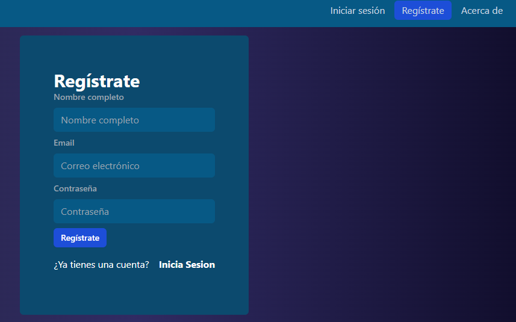
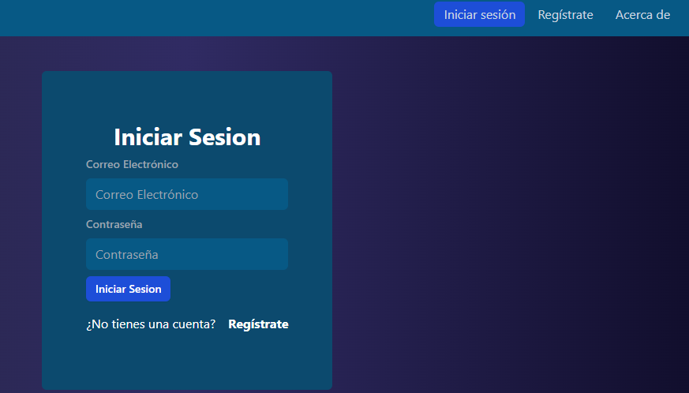
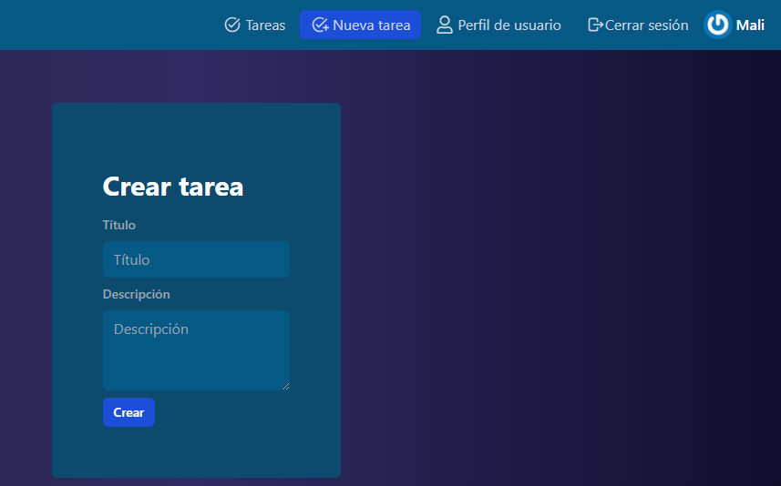
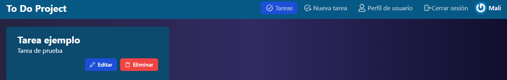

# ToDo Project.

## Descripción

Este es un proyecto desarrollado con el fin de que el usuario cree, edite o elimine tareas con sus respectivas autenticaciones. 

Mi principal motivación para desarrollarlo es porque me parece un proyecto muy completo, ideal para poner en practica los conocimientos adquiridos en el bootcamp con Dev.F.

Al ser un proyecto retador considero que mi principaal aprendizaje fue entender el flujo o el proceso de trabajo que se debe tener para que el avance sea exitoso.

## Índice

-  [Tecnologías](#tecnologias)

-  [Uso](#uso)

-  [Créditos](#créditos)

-  [Licencia](#licencia)

## Tecnologías

       

## Uso

En la aplicacion está la ventana de registro para usuarios nuevos:

En caso de que el usuario ya se haya registrado, puede iniciar sesión:

Despues de iniciar sesión el usuario puede ver las tareas que haya creado o tambien puede crear tareas nuevas:

Despues de crear tareas puede visualizarlas, editarlas o eliminarlas según su requerimiento:

Por último, el usuario puede cerrar la sesión e ingresar nuevamente para ver sus tareas cuando desee.

## Crédito

Agradecimiento especial a Malinali Becerril y Sebastián Mendez por gran su ayuda en la tutoria del bootcamp.

Adicional a los siguientes canales de YouTube que fueron de gran importancia:

- https://www.youtube.com/@midulive
- https://www.youtube.com/@FaztTech
- https://www.youtube.com/@jonmircha

## Licencia

Este proyecto cuenta con licencia MIT.

---

